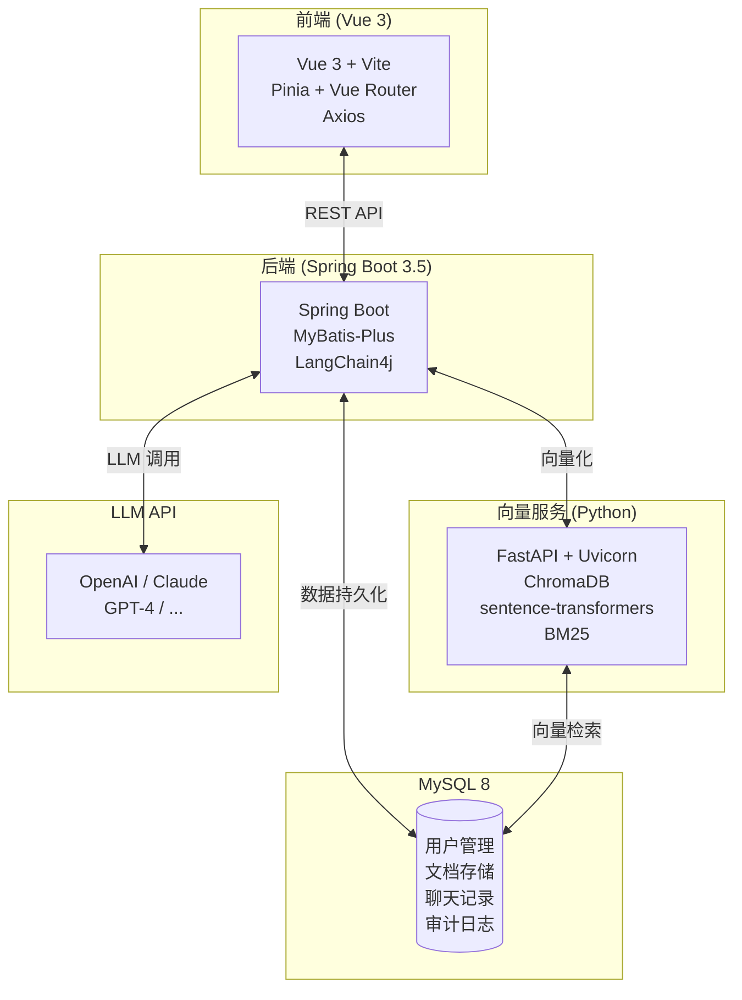
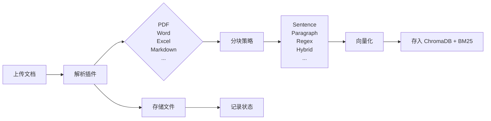
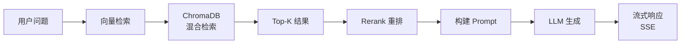

# DocMind RAG

基于 RAG（检索增强生成）的智能文档问答系统，支持文档上传、向量检索、多模型配置和完整的审计日志。

## 功能特性

| 功能 | 说明 |
|------|------|
| **RAG 聊天** | 基于向量检索和 LLM 的智能问答，支持流式响应和混合检索 |
| **文档管理** | 支持 PDF、Word、Excel、PPT、Markdown、TXT 等多格式文档上传、解析和向量化 |
| **分块策略** | 支持 Sentence、Paragraph、Regex、Hybrid 等多种智能分块策略 |
| **AI 模型配置** | 支持配置多种 LLM 提供商（OpenAI、Claude 等）和 Embedding 模型 |
| **审计日志** | 完整的操作审计，支持敏感数据脱敏、异步写入和降级保障 |

## 技术栈

### 系统架构



### 后端 (Java)
- **框架**: Spring Boot 3.5.13
- **数据库**: MySQL 8.0 + Flyway 迁移
- **ORM**: MyBatis-Plus 3.5.15
- **AI**: LangChain4j 1.12.2
- **文档解析**: Apache PDFBox 3.0.7, Apache POI 5.5.1, CommonMark 0.28.0

### 前端 (Vue)
- **框架**: Vue 3.4 + TypeScript 6.0
- **构建**: Vite 5.2
- **状态管理**: Pinia 2.1
- **路由**: Vue Router 4.3

### 向量服务 (Python)
- **框架**: FastAPI 0.115 + Uvicorn 0.32
- **向量数据库**: ChromaDB 1.3
- **Embedding**: sentence-transformers 3.2

## 快速开始

### 环境要求

| 组件 | 版本要求 |
|------|---------|
| JDK | 21+ |
| Node.js | 18+ |
| Python | 3.10+ |
| MySQL | 8.0+ |

### 1. 克隆项目

```bash
git clone <repository-url>
cd DocMindRAG
```

### 2. 配置数据库

创建 MySQL 数据库：

```sql
CREATE DATABASE docmind DEFAULT CHARACTER SET utf8mb4 COLLATE utf8mb4_unicode_ci;
```

复制并修改配置文件：

```bash
copy .env.example .env
# 编辑 .env 文件，设置数据库连接信息
```

### 3. 启动后端服务

```bash
# 使用 Maven 启动
./mvnw spring-boot:run

# 或打包后运行
./mvnw clean package -DskipTests
java -jar target/DocMindRAG-0.0.1-SNAPSHOT.jar
```

服务启动后访问 http://localhost:8081

### 4. 启动向量服务

```bash
cd vector-service

# Windows
install.bat

# 或手动安装
python -m venv venv
.\venv\Scripts\Activate.ps1
pip install -r requirements.txt

# 启动服务
python main.py
```

向量服务启动后访问 http://localhost:8001/docs 查看 API 文档。

### 5. 启动前端开发服务器

```bash
cd frontend
npm install
npm run dev
```

前端访问 http://localhost:5173

## 项目结构

```
DocMindRAG/
├── src/main/java/yuuine/docmind/
│   ├── common/                    # 公共组件
│   │   ├── config/                # 配置类
│   │   ├── constant/              # 常量定义
│   │   ├── exception/             # 异常处理
│   │   ├── filter/                # 过滤器 (TraceId)
│   │   └── model/                 # 统一响应模型
│   │
│   ├── controller/                # REST 控制器
│   │   ├── UserController.java    # 用户管理
│   │   ├── DocumentController.java # 文档管理
│   │   ├── ChatController.java    # 聊天会话
│   │   ├── ModelController.java   # AI 模型配置
│   │   ├── AuditController.java   # 审计日志
│   │   └── HealthController.java  # 健康检查
│   │
│   └── core/                      # 核心业务模块
│       ├── audit/                 # 审计日志 (AOP + 异步)
│       ├── chat/                  # 聊天服务 (RAG 流水线)
│       ├── document/              # 文档解析 + 分块
│       ├── model/                 # AI 模型管理
│       └── user/                  # 用户服务
│
├── plugin/                        # 插件化扩展
│   ├── embedding/                 # 向量化插件
│   ├── parser/                    # 文档解析插件
│   ├── rerank/                    # 重排插件
│   ├── storage/                   # 存储插件
│   └── vectorstore/               # 向量存储插件
│
├── frontend/src/                 # Vue 3 前端
│   ├── components/                # 公共组件
│   ├── pages/                     # 页面组件
│   ├── stores/                    # Pinia 状态
│   └── composables/               # 组合式函数
│
├── vector-service/                # Python 向量微服务
│   ├── main.py                    # FastAPI 入口
│   ├── config.py                  # 配置管理
│   ├── chroma.py                   # ChromaDB 封装
│   ├── embedding.py               # Embedding 服务
│   └── bm25_index.py              # BM25 索引
│
├── docs/                          # 设计文档
│   ├── design_doc.md              # 数据库和 API 设计
│   ├── audit-system.md            # 审计日志使用指南
│   └── audit-system-design.md     # 审计日志技术设计
│
└── src/main/resources/
    ├── db/migration/              # Flyway 数据库迁移
    ├── application.yml            # Spring Boot 配置
    └── rag-prompt.yml             # RAG 提示词模板
```

## 主要模块说明

### 文档处理流水线



### RAG 聊天流水线



### 审计日志

- **零侵入**: 通过 `@Audited` 注解声明式记录
- **异步写入**: 不影响主业务性能
- **敏感数据脱敏**: 自动过滤密码、手机号、身份证等
- **降级保障**: 数据库不可用时写入本地文件

## API 概览

详细 API 文档见 [docs/design_doc.md](docs/design_doc.md)

| 模块 | 端点 | 说明 |
|------|------|------|
| **用户** | `POST /api/v1/users/register` | 用户注册 |
| | `POST /api/v1/users/login` | 用户登录 |
| **文档** | `POST /api/v1/documents/upload` | 上传文档 |
| | `GET /api/v1/documents` | 文档列表 |
| | `DELETE /api/v1/documents/{id}` | 删除文档 |
| **聊天** | `POST /api/v1/chat/sessions` | 创建会话 |
| | `POST /api/v1/chat/sessions/{id}/messages` | 发送消息 |
| | `GET /api/v1/chat/sessions/{id}/messages/stream` | 流式响应 (SSE) |
| **模型** | `GET /api/v1/models` | 获取模型列表 |
| | `POST /api/v1/models` | 创建模型配置 |
| **审计** | `GET /api/v1/audit/logs` | 查询审计日志 |

## 配置说明

### 后端配置 (application.yml)

```yaml
# 数据库
spring.datasource.url=jdbc:mysql://localhost:3306/docmind

# 服务器端口
server.port=8081

# 文档存储
docmind.storage.local.base-path=./data/storage

# 向量服务地址
docmind.embedding.python.url=http://localhost:8001
```

### 向量服务配置 (.env)

```env
SERVICE_PORT=8001
EMBEDDING_MODEL_NAME=paraphrase-multilingual-MiniLM-L12-v2
EMBEDDING_DEVICE=cpu
CHROMA_PERSIST_PATH=./data/chroma_db
```

## 开发指南

### 添加新的文档解析器

1. 实现 `ParserPlugin` 接口
2. 注册为 Spring Bean
3. 在 `ParserPluginFactory` 中添加工厂映射

### 使用审计日志

```java
@Audited(
    action = AuditAction.DOCUMENT_UPLOAD,
    resourceType = "Document",
    describe = "上传文档",
    sensitiveParams = {"content"}
)
@PostMapping("/upload")
public Result<DocumentResponse> upload(...) { }
```

### 扩展分块策略

```java
// 在 ChunkingStrategyFactory 中注册新策略
public enum ChunkingStrategyType {
    SENTENCE, PARAGRAPH, REGEX, HYBRID, YOUR_CUSTOM
}
```

## 许可证

本项目采用 MIT 许可证，详见 [LICENSE](LICENSE) 文件。
